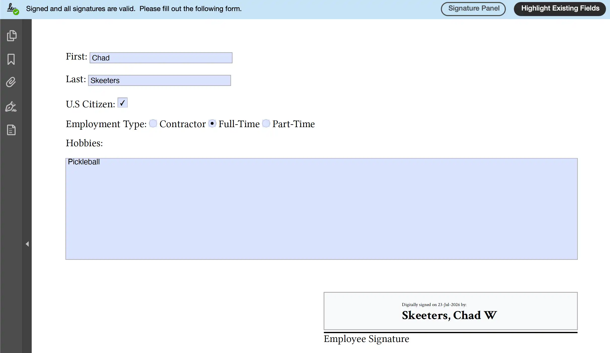

[Typst](https://typst.app) doesn't yet support creating PDF files with forms and fields (AcroForm). [^1]  However, forms and fields can be added to PDF files via [pypdf](https://github.com/py-pdf/pypdf), and digital signature fields can be added with [pyHanko](https://github.com/MatthiasValvekens/pyHanko).  `tyaf` will compile a Typst project file to a PDF and then add digital signature fields form fields based on `metadata` extracted using Typst's `eval`, which tells tyaf where the fields belong.  The `metadata` elements can be automatically generated using [typst-fillable](https://github.com/carpe-diem/typst-fillable).

# Example



```typ
#import "@local/typst-fillable:1.0.0": *

First: #text_field("first", width: 150pt, height: 1em)

Last: #text_field("last", width: 150pt, height: 1em)

U.S Citizen: #checkbox_field("citizen")

Employment Type:
#radio_field("contractor", "employment_type", selected: false) Contractor
#radio_field("full-time", "employment_type", selected: false) Full-Time
#radio_field("part-time", "employment_type", selected: false) Part-Time

Hobbies:
#textarea_field("hobbies",  height: 1.5in)

#v(2em)

#grid(
  columns: (1fr, 1fr),
  [],
  {
    signature_field("employee_signature")
    {
      set block(above: 3pt, below: 3pt)
      line(stroke: 1pt, length: 100%)
    }
    [Employee Signature]
  }
)
```

```sh
tyaf employee.typ
```

>     Adding signature field for employee_signature
>     Adding first as text
>     Adding last as text
>     Adding citizen as checkbox
>     Adding contractor as radio in employment_type
>     Adding full-time as radio in employment_type
>     Adding part-time as radio in employment_type
>     Adding hobbies as textarea

Field values can be extracted to JSON with [afj](https://github.com/cskeeters/afj).

```sh
afj employee.pdf | jq
```

```json
{
  "first": "Chad",
  "last": "Skeeters",
  "citizen": "Off",
  "employment_type": "full-time",
  "hobbies": "Pickleball"
}
```

Extract individual values in a Bash.

```sh
FIRST=$(afj employee.pdf | jq -r '.first')
echo "Welcome to the team, $FIRST!"
```

Save current values to a JSON file.

```sh
afj employee.pdf > me.json
```

Load current values from a JSON file.

```sh
afj -l me.json employee.pdf
```

## Add Signature

After generating a PDF file with a digital signature field, a signature can be added with:

```sh
# Compile to set current date and produce plain.pdf for pyhanko to add to the pdf.
typst compile plain.typ

# Add digital signature
pyhanko --config pyhanko.yml sign addsig --field employee_signature --style-name plain pkcs11 --p11-setup CAC "employee.pdf" "employee (signed).pdf"
```

NOTE: `plain.typ` can be customized to include company logos, etc.

pyhanko.yml:
```yaml
stamp-styles:
    plain:
        type: text
        # Might want this an another folder.  Can be an absolute path.
        background: plain.pdf
        background-opacity: 1
        stamp-text: " "
        border-width: 0
pkcs11-setups:
    CAC:
        module-path: /usr/local/lib/keychain-pkcs11.dylib
        # key-id: 2 # Don't need

        # Digital signature certs are typically 0x02
        # To verify, install OpenSC and run:
        #     pkcs11-tool --list-objects --type cert
        cert-id: 2
```

# Installation

```sh
brew install python uv
```

```sh
git clone git@github.com:cskeeters/tyaf.git
cd tyaf
# Requries uv to install the tool
make
```

Signature Support:

```sh
pip3 install pyhanko-cli
```

CAC/PKSC11 Support:

```sh
brew install opensc
pip3 install 'pyHanko[pkcs11]'
```

# Related Tools

* [afj](https://github.com/cskeeters/afj)
* [aft](https://github.com/cskeeters/aft)
* [pyHanko](https://github.com/MatthiasValvekens/pyHanko)
* [OpenSC](https://github.com/OpenSC/OpenSC)
* [keychain-pkcs11](https://github.com/kenh/keychain-pkcs11)
* [carpe-diem/typst-fillable](https://github.com/carpe-diem/typst-fillable)

[^1]: https://github.com/typst/typst/issues/1765
